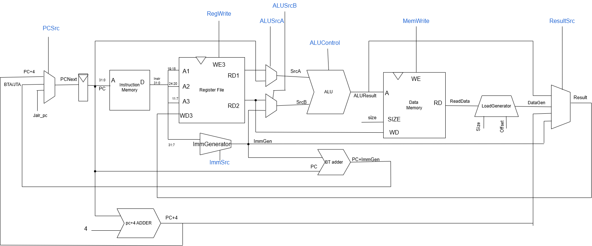

## RV32I_SC
------------------------------------------------------------------------

## Overview

The core is written entirely in SystemVerilog and follows a **clean,
single-cycle** architecture for simplicity and readability
Instruction fetch, decode, execute, memory, and writeback occur within
one clock cycle.
- Complete **RV32I base instruction set** support
- Compatible with open-source simulators such as **Icarus Verilog**,
**Verilator**, and **GTKWave**.

------------------------------------------------------------------------

## Module Overview

### **Top-Level**

-   **`top.sv`** --- SoC wrapper; instantiates CPU (`rv32i_sc`),
    instruction memory, and data memory
-   **`rv32i_sc.sv`** --- Main CPU core integrating the controlpath  and
    datapath.

### **Datapath**

-   **`datapath.sv`** --- Connects the ALU, register file, immediate
    logic, and multiplexers
-   **`registerFile.sv`** --- 32×32 register file with two read ports and one
    write port (x0 = 0)
-   **`alu.sv`** --- Implements arithmetic, logical, and shift
    operations
-   **`adder.sv`** --- Simple adder for PC increment and branch
    targets
-   **`immGenerator.sv`** --- Extracts generates sign-extends immediates for all
    instruction types
-   **`loadGenerator.sv`** --- Generate byte/halfword loads with correct
    sign or zero extension , intended to write back.



### **Control Path**

-   **`controlpath .sv`** --- Generates control signals and coordinates
    the instruction flow
-   **`mainDecoder.sv`** --- Decodes opcodes into high-level control
    signals (e.g., RegWrite, ALUSrc, MemToReg)
-   **`aluDecoder.sv`** --- Decodes funct3/funct7 fields for specific
    ALU operations
-   **`branchLogic.sv`** --- Evaluates branch conditions and determines
    branch decisions.


### **Memory**

-   **`instructionMem.sv`** --- Instruction memory (read-only, initialized from
    file)

-   **`dataMem.sv`** --- Data memory (read/write) 

### **Utilities**

-   **`mux2to1.sv`, `mux3to1.sv`, `mux4to1.sv`** --- Multiplexers used
    throughout the datapath
-   **`ff_r.sv`, `ff_enr.sv`** --- Flip-flops with reset and optional
    enable.

------------------------------------------------------------------------
### How to Run
```bash
# From project root
iverilog -g2012 -o tb_sim/top.vvp -s top_tb files/*.sv tb/*.sv 
vvp tb_sim/riscv.vvp        
```
------------------------------------------------------------------------
